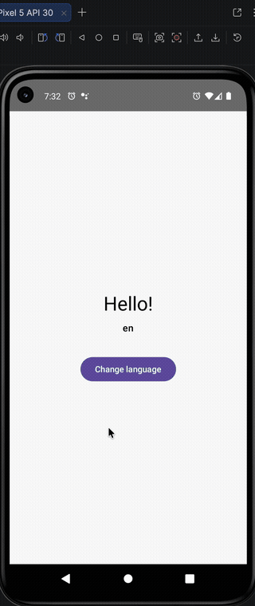
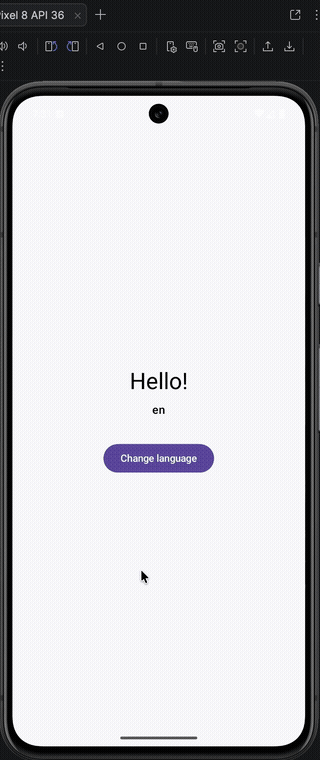
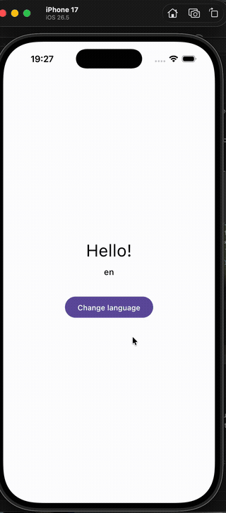

# KLocale

[](https://central.sonatype.com/artifact/io.github.nowjordanhappy/klocale)
[](LICENSE)
[](https://kotlinlang.org)

Kotlin Multiplatform library for **in-app language switching** on Android and iOS.  
No Compose dependency — exposes a `StateFlow<String>` you consume however you like.

## Demo

| Android (API 30) | Android (API 36) | iOS |
|:---:|:---:|:---:|
|  |  |  |

## The problem

Every KMP project that needs in-app language switching reinvents the same glue code. KLocale packages the correct platform calls (`AppCompatDelegate` on Android, `NSUserDefaults` on iOS) behind a single shared API.

## Installation

```kotlin
// build.gradle.kts
dependencies {
    implementation("io.github.nowjordanhappy:klocale:1.0.0")
}
```

Requires **Android minSdk 21+**. AppCompat 1.7 handles the backport automatically; on Android 13+ it delegates to the system `LocaleManager`.

## Usage

```kotlin
val klocale = KLocale(
    supported = listOf("es", "en", "pt", "fr", "it"),
    fallback = "en",
    onChanged = { code -> settings.putString("language", code) } // optional
)

// Observe in ViewModel / Composable
klocale.current               // StateFlow<String>

// Map device locale to your supported list (e.g. "fr-CA" → "fr")
klocale.getSystemDefault()

// Switch language
klocale.set("es")
```

`onChanged` is the only persistence hook — use DataStore, multiplatform-settings, or nothing. KLocale does not persist anything itself.

## Android setup

### 1. Gradle dependency (already handled by KLocale)

AppCompat 1.7.0 is pulled in automatically.

### 2. Manifest — enable per-app language in Settings

Add to `<application>` in `AndroidManifest.xml`:

```xml
<application
    android:localeConfig="@xml/locale_config"
    ...>
```

Create `res/xml/locale_config.xml` listing every code from your `supported` list:

```xml
<?xml version="1.0" encoding="utf-8"?>
<locale-config xmlns:android="http://schemas.android.com/apk/res/android">
    <locale android:name="es"/>
    <locale android:name="en"/>
    <locale android:name="pt"/>
    <locale android:name="fr"/>
    <locale android:name="it"/>
</locale-config>
```

Without this the library still works, but the per-app language option won't appear in **Settings → Apps → [App] → Language** on Android 13+.

### 3. Activity recreation

`set()` triggers an Activity recreation on Android (same behavior as the system language switch). Save any unsaved state **before** calling `set()`.

## iOS setup

### 1. Info.plist — enable language picker in Settings

```xml
<key>CFBundleLocalizations</key>
<array>
    <string>es</string>
    <string>en</string>
    <string>pt</string>
    <string>fr</string>
    <string>it</string>
</array>
```

### 2. Behavior

`set()` writes to `NSUserDefaults` (`AppleLanguages` key) and updates `current` immediately. The system language change takes effect on the **next app launch** — this is standard iOS behavior.

## Requirements

| Platform | Minimum |
|---|---|
| Android | API 21 (AppCompat 1.7) |
| iOS | iOS 13 |
| Kotlin | 2.1+ |

## License

[MIT](LICENSE)
